```mermaid
classDiagram
    %% DB 層
    class HistoricalBase {
        +start_date: datetime
        +end_date: datetime
        +is_active_at(reference_date): bool
    }

    class User {
        +id: int
        +user_id: int
        +name: str
        +email: str
    }

    class Product {
        +id: int
        +product_id: int
        +name: str
    }

    HistoricalBase <|-- User
    HistoricalBase <|-- Product

    %% Repository 層
    class HistoricalRepository {
        +session
        +model_class
        +schema_class
        +find_active_one(reference_date, **filters)
        +save(data)
        +update(data)
    }

    %% Service 層
    class UserService {
        +repo: HistoricalRepository
        +get_user_at(user_id, reference_date)
        +create_user(input)
        +update_user(user_id, input)
    }

    class ProductService {
        +repo: HistoricalRepository
        +get_product_at(product_id, reference_date)
        +create_product(input)
        +update_product(product_id, input)
    }

    %% API / UI 層
    class UserSchema {
        +id: int
        +user_id: int
        +name: str
        +email: str
    }

    class ProductSchema {
        +id: int
        +product_id: int
        +name: str
    }

    %% 関係
    UserService --> HistoricalRepository
    ProductService --> HistoricalRepository
    HistoricalRepository --> User
    HistoricalRepository --> Product
    UserService --> UserSchema
    ProductService --> ProductSchema
```

## 履歴管理システム（Pydantic中心設計）全体像

---

💡 補足

* `HistoricalBase` が **履歴共通フィールド** を持つベースクラス
* `HistoricalRepository` は **SQLAlchemyモデルとPydanticモデルの橋渡し**
* `Service` は **内部処理・履歴管理ロジック担当**
* `Schema` は **DTO / Pydanticモデル**
* GitHub 上で `.md` に貼るだけで自動的にレンダリングされます

---

希望であれば、**CRUD処理の流れも含めたシーケンス図** にして、履歴更新や有効判定の流れも可視化できます。
作ってほしいですか？
