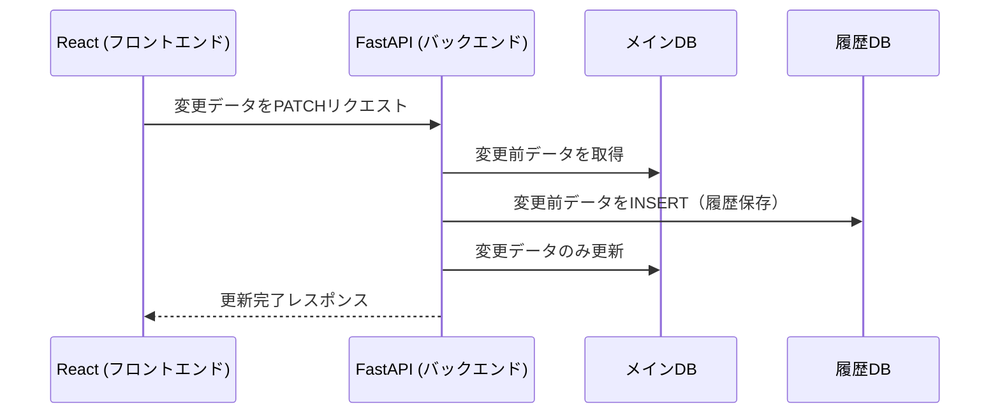

このフローは、**メインDBの更新と履歴DBの記録**を含んでいます。  

---

---

## **💡 解説**
1. **React から FastAPI に `PATCH` リクエスト**
2. **FastAPI がメインDBから変更前データを取得**
3. **取得したデータを履歴DBに `INSERT`**
4. **メインDBの該当フィールドのみ `UPDATE`**
5. **React に「更新成功」のレスポンスを返す**

この流れなら、**履歴管理も含めたデータ更新の仕組み**をシンプルに実装できますね！ 🚀
