```mermaid
sequenceDiagram
    participant React as React (フロントエンド)
    participant API as FastAPI (バックエンド)
    participant MainDB as メインDB
    participant HistoryDB as 履歴DB

    React->>API: 変更データをPATCHリクエスト
    API->>MainDB: 変更前データを取得
    API->>HistoryDB: 変更前データをINSERT（履歴保存）
    API->>MainDB: 変更データのみ更新
    API-->>React: 更新完了レスポンス
```

このフローは、**メインDBの更新と履歴DBの記録**を含んでいます。  

---



---

## **💡 解説**
1. **React から FastAPI に `PATCH` リクエスト**
2. **FastAPI がメインDBから変更前データを取得**
3. **取得したデータを履歴DBに `INSERT`**
4. **メインDBの該当フィールドのみ `UPDATE`**
5. **React に「更新成功」のレスポンスを返す**

この流れなら、**履歴管理も含めたデータ更新の仕組み**をシンプルに実装できますね！ 🚀

tsx
```tsx
const handleSubmit = async () => {
  const updatedData = Object.keys(formData).reduce((acc, key) => {
    if (formData[key] !== professor[key]) {
      acc[key] = formData[key];
    }
    return acc;
  }, {});

  if (Object.keys(updatedData).length > 0) {
    await fetch(`/api/professors/${professor.id}`, {
      method: "PATCH",
      headers: { "Content-Type": "application/json" },
      body: JSON.stringify(updatedData),
    });
  }
};
```

