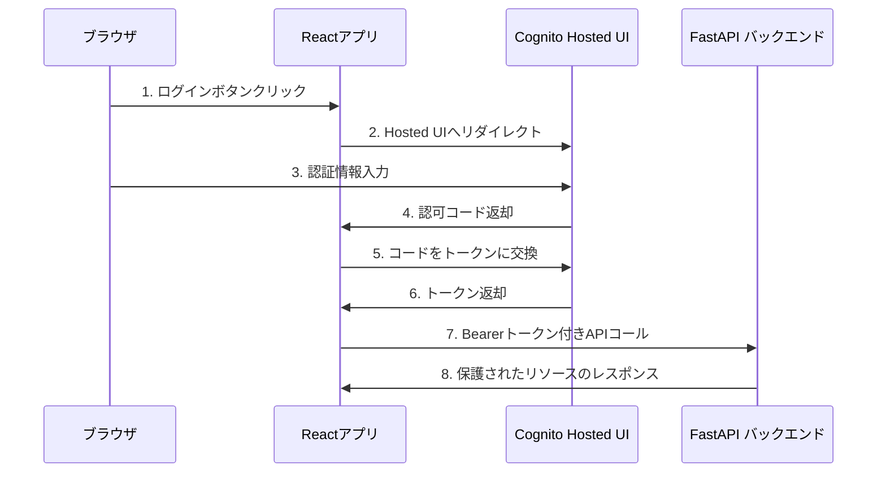
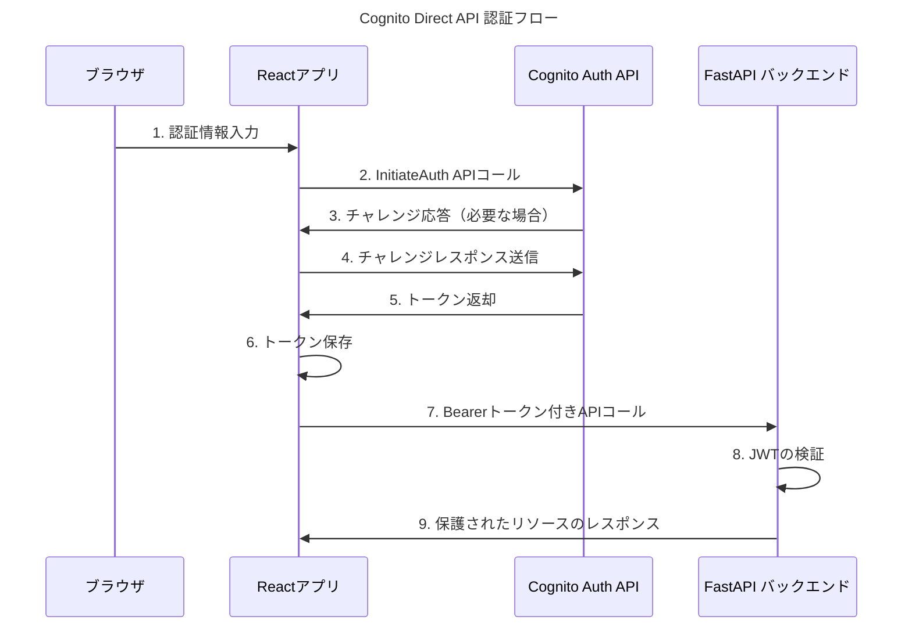

1. Hosted UI Flow の特徴：
   - ユーザー認証のUI部分をCognitoに委譲
   - Authorization Code + PKCEフローを使用
   - フロントエンドの実装が比較的シンプル
   - UIのカスタマイズは制限あり
   - セキュリティ実装はAWSに委譲

2. Direct API Flow の特徴：
   - カスタムUIを完全にコントロール可能
   - Cognito APIを直接呼び出し
   - より複雑な認証フローの実装が可能
   - チャレンジレスポンス（MFAなど）の柔軟な処理
   - エラーハンドリングの実装が必要

実装時の選択基準：
- カスタムUIが必要な場合 → Direct API Flow
- 迅速な実装が優先の場合 → Hosted UI Flow
- 複雑な認証フローが必要な場合 → Direct API Flow
- セキュリティ実装を委譲したい場合 → Hosted UI Flow

